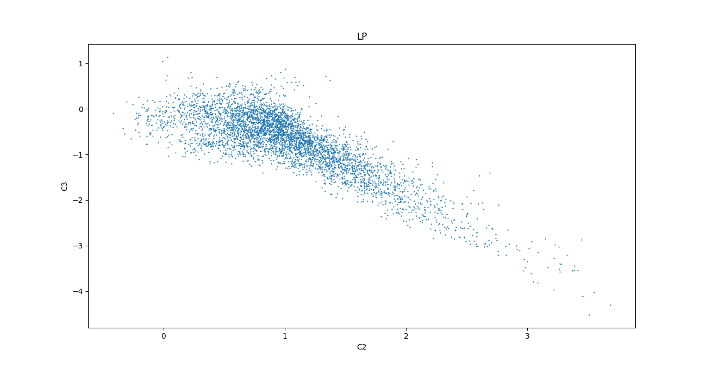
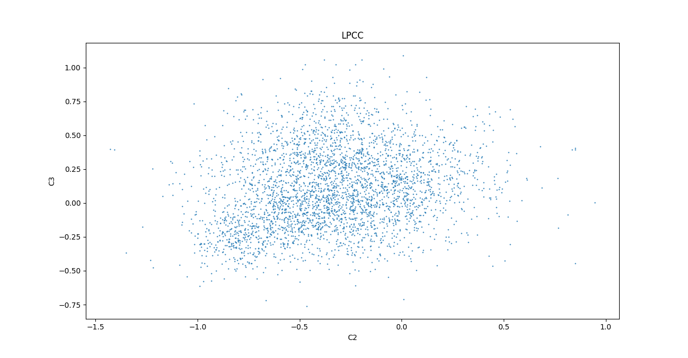
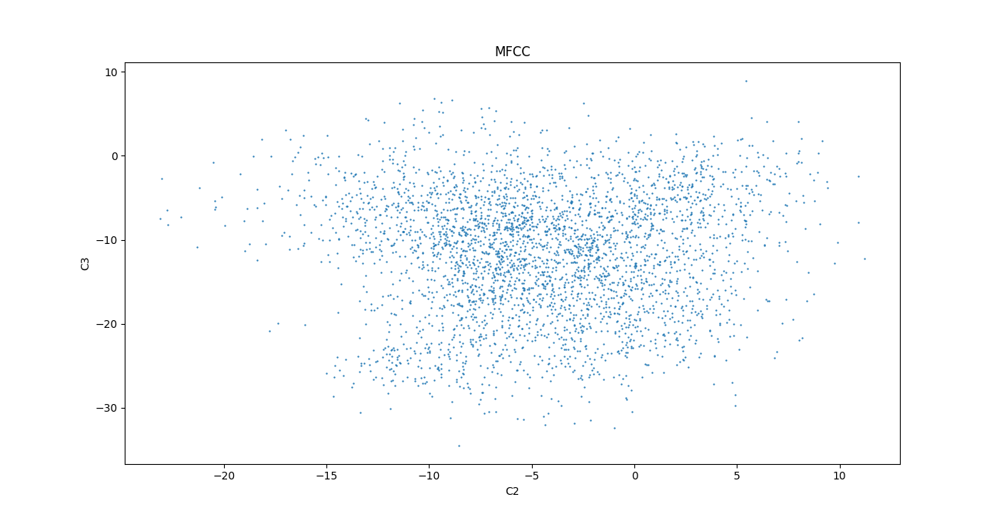
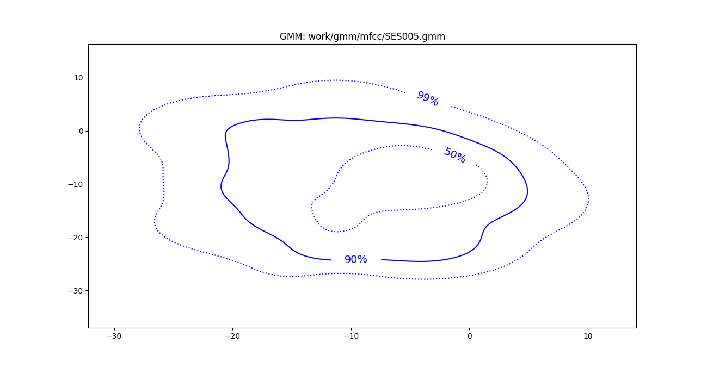
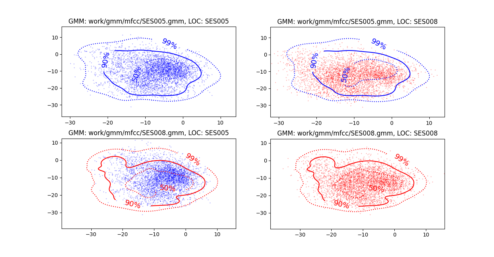
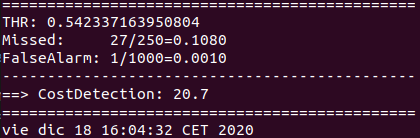

PAV - P4: reconocimiento y verificación del locutor
===================================================

Obtenga su copia del repositorio de la práctica accediendo a [Práctica 4](https://github.com/albino-pav/P4)
y pulsando sobre el botón `Fork` situado en la esquina superior derecha. A continuación, siga las
instrucciones de la [Práctica 2](https://github.com/albino-pav/P2) para crear una rama con el apellido de
los integrantes del grupo de prácticas, dar de alta al resto de integrantes como colaboradores del proyecto
y crear la copias locales del repositorio.

También debe descomprimir, en el directorio `PAV/P4`, el fichero [db_8mu.tgz](https://atenea.upc.edu/pluginfile.php/3145524/mod_assign/introattachment/0/spk_8mu.tgz?forcedownload=1)
con la base de datos oral que se utilizará en la parte experimental de la práctica.

Como entrega deberá realizar un *pull request* con el contenido de su copia del repositorio. Recuerde
que los ficheros entregados deberán estar en condiciones de ser ejecutados con sólo ejecutar:

~~~~~~~~~~~~~~~~~~~~~~~~~~~~~~~~~~~~~~~~~~~~~~~~~~~~~.sh
  make release
  run_spkid mfcc train test classerr verify verifyerr
~~~~~~~~~~~~~~~~~~~~~~~~~~~~~~~~~~~~~~~~~~~~~~~~~~~~~

Recuerde que, además de los trabajos indicados en esta parte básica, también deberá realizar un proyecto
de ampliación, del cual deberá subir una memoria explicativa a Atenea y los ficheros correspondientes al
repositorio de la práctica.

A modo de memoria de la parte básica, complete, en este mismo documento y usando el formato *markdown*, los
ejercicios indicados.

## Ejercicios.

### SPTK, Sox y los scripts de extracción de características.

- Analice el script `wav2lp.sh` y explique la misión de los distintos comandos involucrados en el *pipeline* principal (`sox`, `$X2X`, `$FRAME`, `$WINDOW` y `$LPC`). Explique el significado de cada una de las opciones empleadas y de sus valores.

- SOX: Sirve para cambiar el formato de la señala de entrada y generar una señal con un formato adecuado para que pueda ser la entrada de la siguiente instrucción x2x. Los parámetros que pasamos son los siguientes:
  -t raw: indicamos que la señal de salida la queremos en formato raw.
  -e signed: indicamos el tipo de codificación de la señal de salida.
  -b 16: Tamaño, en bits, de las muestras de salida.

- $X2X: Convierte los datos de la entrada estándar a un tipo de datos diferente y envía el resultado por la salida estándar:
		x2x [ +type1][ +type2][–r][–o][%format ]
	Haciendo x2x +sf indicamos que la salida la queremos en SHORT FORMAT

- $FRAME: Extrae un frame de la secuencia de datos:
		frame [–l L ][–p P ][–n][infile]
	Con los parámetros:
		-l: Tamaño del frame
		-p: Offset entre frames
	Estos parámetros se introducen con el formato de número de muestras, por lo que hemos de tener en cuenta nuestra frecuencia de muestreo para establecerlos.

- $WINDOW: Enventanado de los datos:
		window [–l L1 ][–L L2][–n N ][–w W ][infile]
	Con los parámetros:
		-l: Tamaño del frame de entrada
		-L: Tamaño del frame de salida
		-W: Tipo de ventana

- $LPC: Análisis de PC utilizando el método de Levinson-Durbin:
		lpc [–l L ][–m M ][–f F ][infile]
	Con los parámetros:
		-l: Tamaño del frame de entrada
		-m: Orden Lpc


- Explique el procedimiento seguido para obtener un fichero de formato *fmatrix* a partir de los ficheros de salida de SPTK (líneas 45 a 47 del script `wav2lp.sh`).

```cpp
# Our array files need a header with the number of cols and rows:
ncol=$((lpc_order+1)) # lpc p =>  (gain a1 a2 ... ap) 
nrow=$($X2X +fa < $base.lp | wc -l | perl -ne 'print $_/'$ncol', "\n";')

# Build fmatrix file by placing nrow and ncol in front, and the data after them
echo $nrow $ncol | $X2X +aI > $outputfile
cat $base.lp >> $outputfile
```

Observando la documentación de la salida de las funciones empleadas, vemos que el número de columnas de nuestra matriz es igual al número de coeficientes lpc + 1 mientras que tendremos tantas filas cómo frames del señal hayamos generado (de duración de -l muestras y tomadas cada -p muestras). Para cada fila guardaremos los coeficientes lp calculados para ese frame. Esa matriz que construimos será finalmente escrita en el outputfile.

  * ¿Por qué es conveniente usar este formato (u otro parecido)? Tenga en cuenta cuál es el formato de
    entrada y cuál es el de resultado.

    Es un formato que nos aporta diversas ventajas. Entre ellas, vemos que nos permite estructurar de manera ordenada los coeficientes calculados para cada frame, lo que también facilita el procesado de la matriz analizando los coeficientes resultantes.

- Escriba el *pipeline* principal usado para calcular los coeficientes cepstrales de predicción lineal
  (LPCC) en su fichero <code>scripts/wav2lpcc.sh</code>:

```cpp
# Main command for feature extration
sox $inputfile -t raw -e signed -b 16 - | $X2X +sf | $FRAME -l 180 -p 100 | $WINDOW -l 180 -L 180 |
	$LPC -l 180 -m $lpc_order | $LPC2C -m $lpc_order -M $lpcc_order > $base.lpcc
```

- Escriba el *pipeline* principal usado para calcular los coeficientes cepstrales en escala Mel (MFCC) en su fichero <code>scripts/wav2mfcc.sh</code>:

```cpp
# Main command for feature extration
sox $inputfile -t raw -e signed -b 16 - | $X2X +sf | $FRAME -l 180 -p 100 | $WINDOW -l 180 -L 180 |
	$MFCC -l 180 -m $mfcc_order > $base.mfcc
```

### Extracción de características.

- Inserte una imagen mostrando la dependencia entre los coeficientes 2 y 3 de las tres parametrizaciones
  para todas las señales de un locutor.
  
  
  
  

  + Indique **todas** las órdenes necesarias para obtener las gráficas a partir de las señales 
    parametrizadas.

```py
import numpy as np
import glob
import matplotlib.pyplot as mpl

def get_d(path):
    all_files = glob.glob(path)
    c = []
    for filename in all_files:
        str = open(filename, 'r').read()
        str = str.split('\n')
        str = str[1:-3]
        for i in range(0,len(str)):
            aux = str[i].split('\t')
            str[i] = float(aux[1])
        c.extend(str)
    return c

c2_lp = get_d('./Datos/lp/c2/*.txt')
c3_lp = get_d('./Datos/lp/c3/*.txt')

c2_lpcc = get_d('./Datos/lpcc/c2/*.txt')
c3_lpcc = get_d('./Datos/lpcc/c3/*.txt')

c2_mfcc = get_d('./Datos/mfcc/c2/*.txt')
c3_mfcc = get_d('./Datos/mfcc/c3/*.txt')


mpl.title("LP")
mpl.scatter(c2_lp, c3_lp, s=0.42)
mpl.xlabel('C2')
mpl.ylabel('C3')
mpl.show()

mpl.title("LPCC")
mpl.scatter(c2_lpcc, c3_lpcc, s=0.42)
mpl.xlabel('C2')
mpl.ylabel('C3')
mpl.show()

mpl.title("MFCC")
mpl.scatter(c2_mfcc, c3_mfcc, s=0.42)
mpl.xlabel('C2')
mpl.ylabel('C3')
mpl.show()
```

  + ¿Cuál de ellas le parece que contiene más información?
Podemos observar en la gráfica para el lp una cierta correlación entre los datos a simple vista, mientras que para el lpcc y el mfcc, la gráfica parece más bien una nube aleatoria de puntos.


- Usando el programa <code>pearson</code>, obtenga los coeficientes de correlación normalizada entre los
  parámetros 2 y 3 para un locutor, y rellene la tabla siguiente con los valores obtenidos.

  |                        | LP   | LPCC | MFCC |
  |------------------------|:----:|:----:|:----:|
  | &rho;<sub>x</sub>[2,3] |-0.818| 0.214| 0.028|
  
  + Compare los resultados de <code>pearson</code> con los obtenidos gráficamente.

  Vemos como los resultados obtenidos son coherentes con las gráficas. Para lp, se aprecia una correlación negativa bastante cercana a 1, lo que hace que se pueda ver a simple vista tan claramente. Para el lpcc se ve una nube dispersa con quizás cierta correlación creciente y, finalmente, para mfcc sí que encontramos una nube totalmente aleatoria.
  
- Según la teoría, ¿qué parámetros considera adecuados para el cálculo de los coeficientes LPCC y MFCC?

  Según la teoría, para el lpcc se recomienda utilizar una predicción de orden 12 y aproximadamente y un 50% más de  coeficientes cepstrales (18). 

  Por otro lado, para el uso de los mfcc, se suelen emplear 13 coeficientes y un banco de filtros que contenga entre 24 i 40.

  Para ambas predicciones, para la longitud de los frames y el offset entre los mismos, se utilizan valores de 20-30 ms y 10-15 ms respectivamente.

### Entrenamiento y visualización de los GMM.

Complete el código necesario para entrenar modelos GMM.

- Inserte una gráfica que muestre la función de densidad de probabilidad modelada por el GMM de un locutor para sus dos primeros coeficientes de MFCC.

  


- Inserte una gráfica que permita comparar los modelos y poblaciones de dos locutores distintos (la gŕafica de la página 20 del enunciado puede servirle de referencia del resultado deseado). Analice la capacidad del modelado GMM para diferenciar las señales de uno y otro.

  

### Reconocimiento del locutor.

Complete el código necesario para realizar reconociminto del locutor y optimice sus parámetros.

- Inserte una tabla con la tasa de error obtenida en el reconocimiento de los locutores de la base de datos SPEECON usando su mejor sistema de reconocimiento para los parámetros LP, LPCC y MFCC.

Se han empleado los mismos parámetros de training para los tres sistemas de reconocimiento.

  |                        | LP   | LPCC | MFCC |
  |------------------------|:----:|:----:|:----:|
  |     tasa de error      |10.32%| 3.06%| 1.15%|

### Verificación del locutor.

Complete el código necesario para realizar verificación del locutor y optimice sus parámetros.

- Inserte una tabla con el *score* obtenido con su mejor sistema de verificación del locutor en la tarea
  de verificación de SPEECON. La tabla debe incluir el umbral óptimo, el número de falsas alarmas y de
  pérdidas, y el score obtenido usando la parametrización que mejor resultado le hubiera dado en la tarea
  de reconocimiento.

  

 
### Test final

- Adjunte, en el repositorio de la práctica, los ficheros `class_test.log` y `verif_test.log` 
  correspondientes a la evaluación *ciega* final.

### Trabajo de ampliación.

- Recuerde enviar a Atenea un fichero en formato zip o tgz con la memoria (en formato PDF) con el trabajo 
  realizado como ampliación, así como los ficheros `class_ampl.log` y/o `verif_ampl.log`, obtenidos como 
  resultado del mismo.
